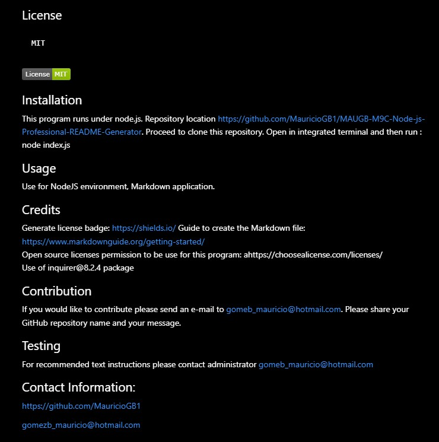

# Professional README Generator (NodeJS)

## Table of Contents
- [Description](#project-description)
- [Installation](#installation)
- [Usage](#usage)
- [Contribution](#contribution)
- [Testing](#testing)

## Project Description
This program helps the user to generate an automatic README professional file; user will be prompted with specific question that has to answer in order the program to generate the file.

Practical use of NodeJS , interacting with Inquire package and fs to create a Readme file.

This program helps to create repetitive and automatic creation of professional README file, getting input from user and then generating the file.

This program shows the use of NodeJS as backend JavaScript to be able to execute the JavaScript code outside of a web browser. This program allows us to utilize additional packages to write the files on a Markdown to prepare the structure of the Readme file. 

Use of NodeJS to write the main index file using JavaScript and Node JS; Install and use of npm package inquirer@8.2.4 for this application. Also, the use of fs package to write a file in this case the Readme file.

Input from user 

Main Overview Application

## License
    MIT
    
  
  

## Installation
This program runs under node.js.  Repository location https://github.com/MauricioGB1/MAUGB-M9C-Node-js-Professional-README-Generator.   Proceed to clone this repository.  Open in integrated terminal and then run : node index.js

## Usage
Use for NodeJS environment, Markdown application.

## Credits
   Generate license badge: https://shields.io/ 
   Guide to create the Markdown file: https://www.markdownguide.org/getting-started/  
   Open source licenses permission to be use for this program: ahttps://choosealicense.com/licenses/  
   Use of inquirer@8.2.4 package

## Contribution
If you would like to contribute please send an e-mail to gomeb_mauricio@hotmail.com. Please share your GitHub repository name and your message.

## Testing
For recommended text instructions please contact administrator gomeb_mauricio@hotmail.com

## For Additional Questions, please contact:
https://github.com/MauricioGB1

gomezb_mauricio@hotmail.com